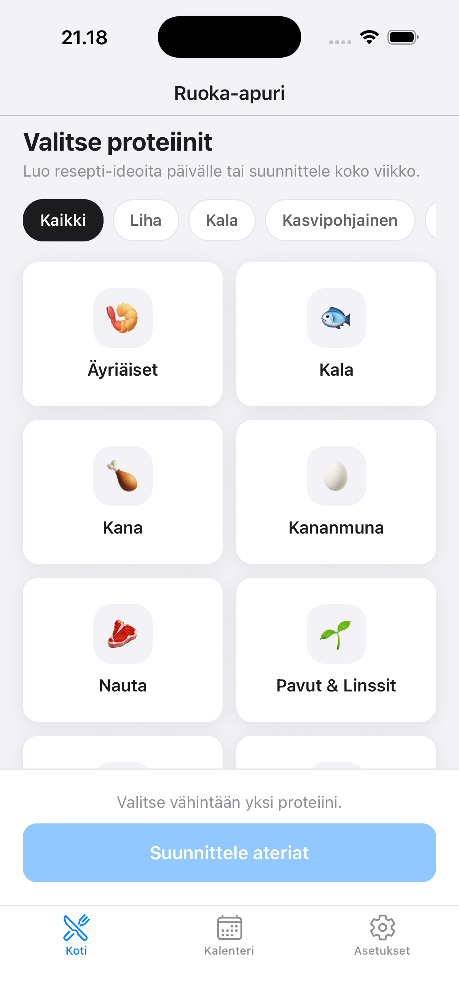
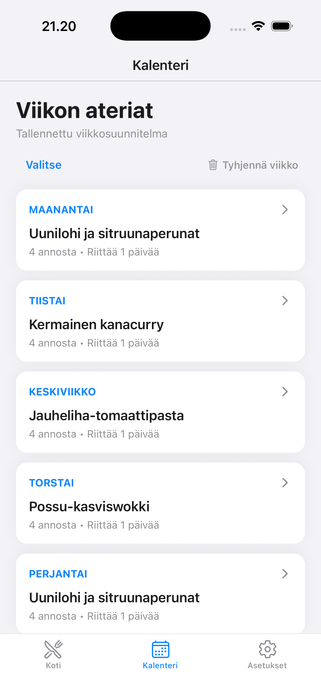
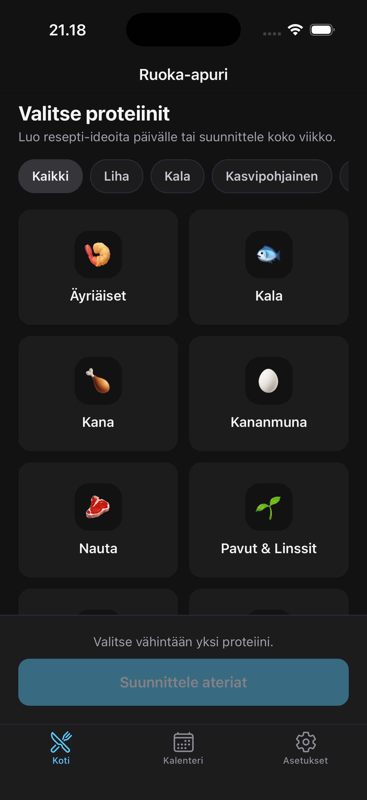
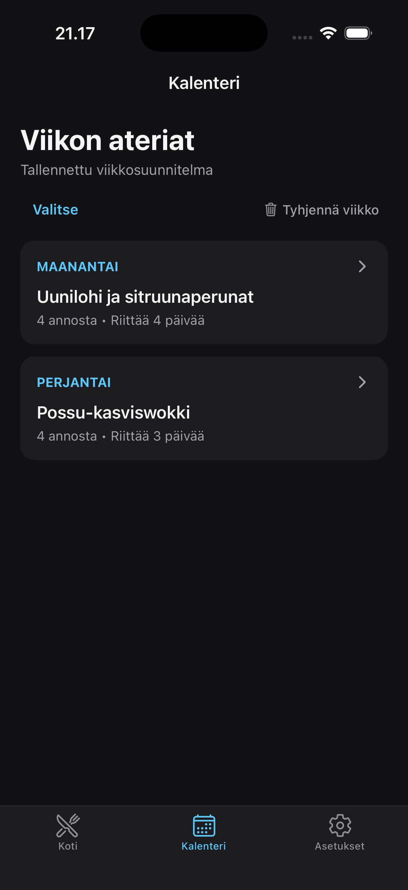

# Ruoka-apuri

A mobile app for weekly meal planning, recipe suggestions, and meal prep management.

<p align="center">
  &nbsp;
  &nbsp;&nbsp;&nbsp;
  &nbsp;
  
</p>

### Features
- **Protein-Based Suggestions:** Discover recipes tailored to selected protein sources.
- **Weekly Planner:** Automated 7-day meal schedules without repetitive meals.
- **Meal Prep & Calendar:** Organize, schedule, and track meals in a clean calendar view.
- **Theme Support:** Fully functional light and dark modes.
- **Localization:** Finnish UI

### Tech Stack
React Native (Expo Router) · TypeScript · Supabase

---

### Getting Started

1. **Clone the repository and install dependencies**
   ```bash
   git clone https://github.com/AleksiPamilo/ruoka-apuri.git
   cd ruoka-apuri
   pnpm install
   ```

2. **Environment variables**
   Create a `.env` file in the root directory:
   ```env
   EXPO_PUBLIC_SUPABASE_URL=your_project_url
   EXPO_PUBLIC_SUPABASE_ANON_KEY=your_anon_key
   ```


3. **Run the app**
   ```bash
   pnpm start
   ```