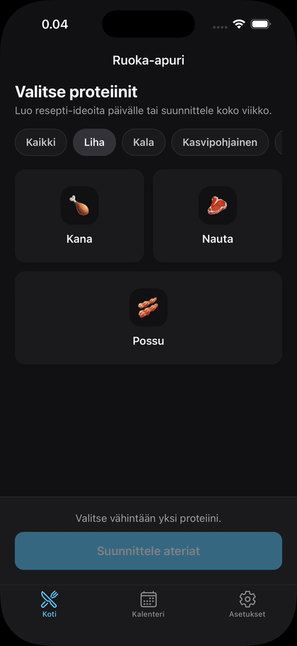

# Ruoka-apuri

A mobile app for weekly meal planning, recipe suggestions, meal prep management, and smart grocery shopping.

<p align="center">
  
</p>

<details>
  <summary>📸 <b>View screenshots (Light & Dark theme)</b></summary>
  <br />
  <p align="center">
    &nbsp;
    &nbsp;&nbsp;&nbsp;
    &nbsp;
    
  </p>
</details>

### Features
- **Protein-Based Suggestions:** Discover recipes tailored to selected protein sources.
- **Weekly Planner & Calendar:** Automated 7-day meal schedules, slot replacement, and custom plan templates.
- **Smart Shopping List (Ostoslista):** Automated ingredient aggregation from active meals, custom item entry, supermarket aisle categorization, and native sharing.
- **Meal Prep Management:** Schedule batch-cooked meals across multiple days.
- **Theme Support:** Fully functional light and dark modes.
- **Localization:** Finnish UI

> [!NOTE]
> Demo recipes and sample data in this project were generated with AI.

### Tech Stack
React Native (Expo Router) · TypeScript · Supabase

---

### Getting Started

1. **Clone the repository and install dependencies**
   ```bash
   git clone https://github.com/AleksiPamilo/ruoka-apuri.git
   cd ruoka-apuri
   pnpm install
   ```

2. **Environment variables**
   Create a `.env` file in the root directory:
   ```env
   EXPO_PUBLIC_SUPABASE_URL=your_project_url
   EXPO_PUBLIC_SUPABASE_ANON_KEY=your_anon_key
   ```

3. **Run the app**
   ```bash
   pnpm start
   ```